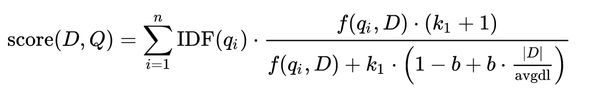
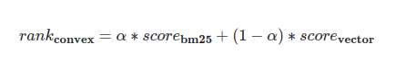
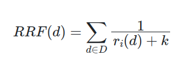
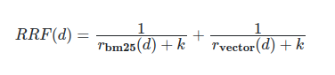

# Hybrid Search in CrateDB.

CrateDB supports three search functions: kNN search via `KNN_MATCH`, bm25 search via `MATCH`
and geospatial search via `MATCH`.

Hybrid Search is a technique that enhances relevancy and accuracy by combining the results of two or
more search algorithms, achieving better accuracy and relevancy than each algorithm would
individually.

A common scenario is where we combine semantic search (vector search) with lexical search (keyword
search). Semantic search excels at understanding the context of a phrase and lexical is great at
finding how
many times a keyword or phrase appears in a document, taking into account the length and the average
length of your documents

Imagine an e-commerce that sells tech products. The user could query "gpu ASUS" or "
graphic
card ASUS," Semantic search would understand that both "gpu" and "graphic card" refer to a "graphics
processing unit."
If we relied solely on semantic search, we would only get results for graphic cards. However,
since the user is specifying a particular brand "ASUS," wouldn't it be great if we could return
results that match both the exact product type and the specific brand they are looking for?

## Full-text search (BM25).

<sub>More in: https://cratedb.com/docs/crate/reference/en/latest/general/dql/fulltext.html</sub>

BM25 or full-text search is a [bag-of-words](https://en.wikipedia.org/wiki/Bag-of-words_model)
algorithm that ranks an unordered set of documents
based on the keywors of a query. It takes into account the number of times the keywords appear, the
length of the document and the average length of all documents.



Source: Wikipedia - Okapi BM25.

CrateDB leverages Lucene's powerful full-text search capabilities allowing you to heavily tweak this
search; you can search on several columns, add fuzziness, chose between several analyzers,
tokenizers, composite indexes...

To enable full-text search on a column, add a fulltext index.

```sql
CREATE TABLE IF NOT EXISTS "cities"
(
    "city"       TEXT,
    "city_ascii" TEXT INDEX USING FULLTEXT, -- <--- fulltext index
    "lat"        DOUBLE PRECISION,
    "lng"        DOUBLE PRECISION,
    "country"    TEXT,
    "iso2"       TEXT,
    "iso3"       TEXT,
    "admin_name" TEXT,
    "capital"    TEXT,
    "population" BIGINT,
    "id"         BIGINT
)
```

Now we can start doing interesting `MATCH` queries.

```sql
SELECT _score,
       city,
       country,
       population
FROM cities
WHERE MATCH(city_ascii, 'new')
ORDER BY population DESC,
         _score DESC
```

| _score    | city            | country         | population |
|-----------|-----------------|-----------------|------------|
| 2.4358468 | "New York"      | "United States" | 18908608   |
| 2.4358468 | "New Orleans"   | "United States" | 932759     |
| 2.4911938 | "New Haven"     | "United States" | 565572     |
| 2.4358468 | "New Delhi"     | "India"         | 249998     |
| 2.4937067 | "New Bedford"   | "United States" | 153701     |
| 2.4358468 | "New Mirpur"    | "Pakistan"      | 124352     |
| 2.3875484 | "New Braunfels" | "United States" | 92993      |

We can tweak fuzziness to get approximate matches.

```sql
SELECT _score,
       city,
       country,
       population
FROM cities
WHERE MATCH(city_ascii, 'nw yurk') USING best_fields
WITH (fuzziness = 1.1)
ORDER BY
    _score DESC
```

| _score    | city            | country          | population |
|-----------|-----------------|------------------|------------|
| 3.7321026 | "New York"      | "United States"  | 18908608   |
| 3.2022028 | "York"          | "United Kingdom" | 141685     |
| 3.2022028 | "York"          | "United States"  | 8534       |
| 3.0774765 | "York"          | "United States"  | 247176     |
| 3.0774765 | "York"          | "United States"  | 13733      |
| 2.847437  | "Urk"           | "Netherlands"    | 21227      |
| 2.8464477 | "West New York" | "United States"  | 52438      |

### Vector search (k-nearest neighbors).

There are machine learning models that can transform data like text or images into dense vectors (
list of non-zero floating point numbers).
The closer two vectors are in space, the more similar they are, we can use this property to
calculate how similar a query is to our data.

```
"nvidia gpu" -> [0.393, 0.393, 0.02, 0.18, 0.84, 0.49...]
```

They are commonly used for search, clustering, recommendations, classification...

You can store these vectors in
CrateDB's [`FLOAT_VECTOR`](https://cratedb.com/docs/crate/reference/en/latest/general/ddl/data-types.html#float-vector)
type, it supports vectors up to `2048`,
for reference models like OpenAI's `text-embedding-3-small` can generate vectors of length `1536`.

The k-nearest neighbors algorithm calculates the k closest vectors from a given vector, effectively
giving you data that is similar/related, search quality heavily depends on
the model used and the quality of the data. You will need to transform the data you want to search
into vectors.

> Note: CrateDB uses Approximate nearest neighbor search, making it suitable to search through vast
> amounts of data.

```sql
SELECT _score, city, country
FROM cities
-- Vector is truncated here because it's too large to fit in the website.
WHERE KNN_MATCH(xs, [-0.04377000033855438, 0.00526944175362587...], 10)
ORDER BY _score DESC
LIMIT 10;
```

The query is "city of love"

| _score     | city      | country          |
|------------|-----------|------------------|
| 0.4990726  | 'Paris'   | 'United States'  |
| 0.4990726  | 'Paris'   | 'United States'  |
| 0.4990726  | 'Paris'   | 'United States'  |
| 0.4990726  | 'Paris'   | 'France'         |
| 0.4990726  | 'Paris'   | 'Canada'         |
| 0.46543276 | 'Venice'  | 'United States'  |
| 0.46543276 | 'Venice'  | 'Italy'          |
| 0.46269792 | 'Lourdes' | 'France'         |
| 0.45406482 | 'Lyon'    | 'France'         |
| 0.45296928 | 'London'  | 'United Kingdom' |

Interestingly, "napoleon was born in this city" yields:

+ `LIMIT 1`

| _score    | city      | country  |
|-----------|-----------|----------|
| 0.4663355 | 'Ajaccio' | 'France' |

Which is correct.

## Actually doing hybrid search.

As we mentioned before, hybrid search is the combination of two search results; we do one search, we
do another and
then combine the results into a single one, there are many different ways of merging results, we
will cover two
simple yet powerful methods.

### Convex combination.

We can apply a weighted function known as a Convex combination, in simple terms, we add both scores
with a weight, the optimal value of the weight will depend on the data and use case,
for some datasets semantic search might be more important than lexical search, you will need to
experiment and tweak the weight to your
use case.



Where `α` is the weight.
> Both scores need to be normalized between [0, 1].

| bm25_score | vector_score | id |
|------------|--------------|----|
| 0.3843     | 0.2891       | 4  |
| 0.4936     | 0.7352       | 1  |
| 0.1842     | 0.4927       | 6  |

If we take the first row with `α = 0.3`,

`convex = 0.3 * 3.843 + (1 - 0.3) * 0.2891`<br>
`convex = 0.31766`

| bm25_score | vector_score | id | convex  |
|------------|--------------|----|---------|
| 0.4936     | 0.7352       | 1  | 0.66272 |
| 0.1842     | 0.4927       | 6  | 0.40014 |
| 0.3843     | 0.2891       | 4  | 0.31766 |

The new row order DESC is `[1, 6, 4]`

### Reciprocal rank fusion

Reciprocal rank fusion or RRF is a very popular method due to its simplicity and effectiveness, it
merges ranks without caring about the specific scores given by different ranking methods.



Where `k` is a weight, typically recommended to be `60`.

<sub>Source: [Cormack et al.](https://plg.uwaterloo.ca/~gvcormac/cormacksigir09-rrf.pdf)</sub>

Unlike Convex Combination which sums the `scores` for each search method, RRF uses the `rank`. The
rank is the position in the search results, a lower rank indicates better score, being the best
rank `1`.

Let's see an example, given two search results:

| vector_score | id | rank |
|--------------|----|------|
| 0.7352       | 1  | 1    |
| 0.4927       | 6  | 2    |
| 0.2891       | 4  | 3    | 

| bm25_score | id | rank |
|------------|----|------|
| 0.4936     | 1  | 1    |
| 0.3843     | 4  | 2    |
| 0.1842     | 6  | 3    | 

With two searches, our formula expands to:



`rrf(1) = 1 / (60 + 1) + 1 / (60 + 1) = 0.03278`

`rrf(4) = 1 / (60 + 2) + 1 / (60 + 3) = 0.03200`

`rrf(6) = 1 / (60 + 3) + 1 / (60 + 2) = 0.03200`

Let's put everything together to get a clearer look:

| id | bm25_rank | vector_rank | rff     |
|----|-----------|-------------|---------|
| 1  | 1         | 1           | 0.03278 |
| 4  | 2         | 3           | 0.03200 |
| 6  | 3         | 2           | 0.03200 |


### Wrapping it up (An actual example).
Now that you have a more clear overview of hybrid search in CrateDB, let's see
what a one-query hybrid search would look like.

We will leverage [Common table expressions](https://cratedb.com/docs/crate/reference/en/latest/general/dql/selects.html#with-queries-common-table-expressions), to structure
our query, it will look like:

```sql
WITH 
    search_method_1 as (QUERY),
    search_method_2 as (QUERY)

SELECT
    (RE_RANKING) as hybrid_score
FROM
    search_method_1, search_method_2
WHERE search_method_1.id = search_method_2.id
```

> Note how we use a [inner-join](https://cratedb.com/docs/crate/reference/en/latest/general/dql/joins.html#inner-joins) to join results from both search methods into a single table,
> meaning that you will need to have the vector and the full-text indexed columns in the same table or in different
> tables that can be inner-join, either with an id or some other column.

### Convex
In this example we apply a [min/max normalization](https://en.wikipedia.org/wiki/Feature_scaling) to `bm25` which is not normalized by default.
```sql
WITH bm25 as (
  SELECT
    (_score - MIN(_score) OVER ()) / (MAX(_score) OVER () - MIN(_score) OVER ()) as _score,
    title
  FROM
    fs_search
  WHERE
    MATCH("content", 'knn search')
  ORDER BY
    _score DESC
),
vector as (
  SELECT
    _score,
    title
  FROM
    fs_search
  WHERE
    KNN_MATCH(
      xs,
      [vector...],
      15
    )
)
SELECT
  a * bm25._score + (1 - a) * vector._score as hybrid_score,
  bm25._score as bm25_score,
  vector._score as vector_score,
  bm25.title
FROM
  bm25,
  vector
WHERE
  bm25.title = vector.title
ORDER BY
  hybrid_score DESC
```


With $\alpha$ as `0.4`

| hybrid_score        | bm25_score  | vector_score | title                                                                      |
|---------------------|-------------|--------------|----------------------------------------------------------------------------|
| 0.7440367221832276	 | 1	          | 0.57339454	  | knn_match(float_vector, float_vector, int)                                 |
| 0.4868442595005036	 | 0.5512639   | 	0.4438978	  | Searching On Multiple Columns                                              |
| 0.4716400563716888	 | 0.56939983  | 	0.40646687  | 	array_position(anycompatiblearray, anycompatible [, integer ] ) → integer |
| 0.4702456831932068	 | 0.55290174	 | 0.41514164	  | Filter By _score                                                           |
| 0.4677474081516266	 | 0.5523509	  | 0.4113451	   | Text search functions and operators                                        |

> In this example we join by title, but as they are in the same table, we could have used CrateDB internal `_id` column.

### Reciprocal rank fusion

We use [RANK](https://cratedb.com/docs/crate/reference/en/latest/general/builtins/window-functions.html#rank) window function to assign a rank to every row, note how
we don't care about normalizing `bm25` score here.

```sql
WITH bm25 as (
  SELECT
    _score,
    RANK() OVER (
      ORDER BY
        _score DESC
    ) as rank,
    title
  FROM
    fs_search
  WHERE
    MATCH("content", 'knn search')
  ORDER BY
    _score DESC
),
vector as (
  SELECT
    _score,
    RANK() OVER (
      ORDER BY
        _score DESC
    ) as rank,
    title
  FROM
    fs_search
  WHERE
    KNN_MATCH(
      xs,
      [vector...],
      15
    )
)
SELECT
  TRUNC((1.0 / (bm25.rank + 60)) + (1.0 / (vector.rank + 60)), 6) as final_rank,
  bm25.rank as bm25_rank,
  vector.rank as vector_rank,
  bm25.title
FROM
  bm25,
  vector
WHERE
  bm25.title = vector.title
ORDER BY final_rank DESC
```

| final_rank | bm25_rank | vector_rank | title                                       |
|------------|-----------|-------------|---------------------------------------------|
| 0.032786   | 	1        | 	1          | 	knn_match(float_vector, float_vector, int) |
| 0.031054   | 	7        | 	2          | 	Searching On Multiple Columns              |
| 0.030578   | 	8        | 	3          | 	Usage                                      |
| 0.028717   | 	5        | 	15         | 	Text search functions and operators        |
| 0.02837    | 	10       | 	11         | 	Synopsis                                   |

> We trunc `final_rank` for readability.

# Summary
In this article, we cover the concept of hybrid search in CrateDB, combining results from different search methods
to get more relevant results leveraging semantic and lexical search. CrateDB is a great database for creating products 
with this technique due to its strong Resiliency, fast queries thanks to its unique index-all, SQL language, and its rich and complete data types.
